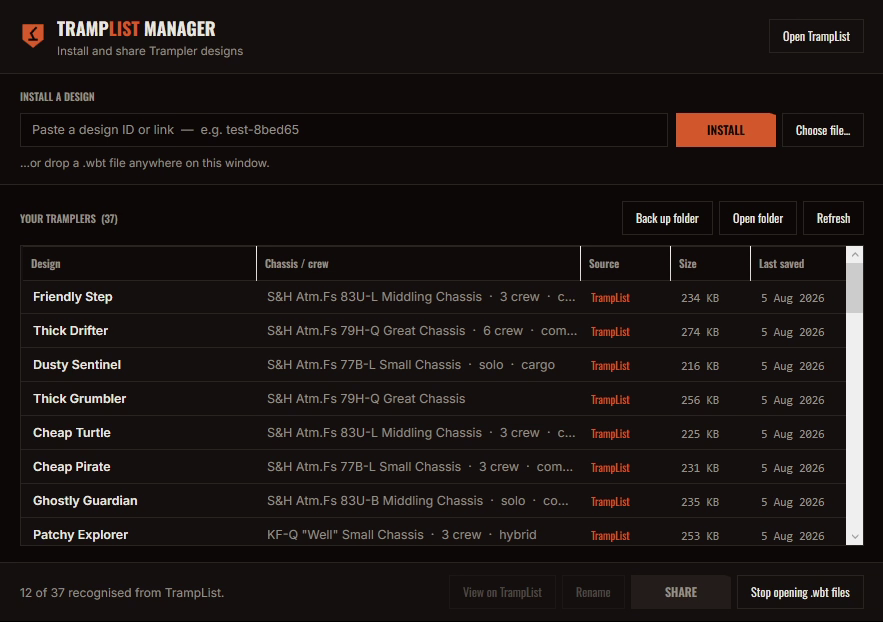

# TrampList Manager

A small Windows companion app for [TrampList](https://www.tramplist.pro) — installs Trampler
designs into *SAND: Raiders of Sophie*, and helps you share your own.



## Install a design

Three ways, all ending in the same place:

- **Paste an ID or link** — `test-8bed65`, a `tramplist.pro/d/…` URL, or a `tramplist://` link
- **Double-click a `.wbt`** — the app claims the extension on first run
- **Drag and drop** — drop a `.wbt` anywhere on the window

The file lands in your Walkers folder under the **design's own UUID**, which is the filename the
game expects — so a design is the same file for everyone, and re-downloading after an author
updates it replaces your copy rather than leaving two. If you already have it, the app asks
whether to replace it or keep both.

## Share your own

Your Walkers folder is listed with chassis, crew and date. Select a Trampler and click
**Upload to TrampList…** — the upload page opens with the blueprint already attached, leaving
you screenshots and a description.

The app holds no login. It hands the file to the site and finishes in your browser, where you're
already signed in with Steam, so no password or session ever passes through it.

## Safety

- Offers to **back up your Walkers folder** before the first install of a session.
- Refuses anything that is not a plausible blueprint: gzip magic (`1f 8b 08`) and a sane size.
- Downloads to a temporary file first, so a failed transfer never leaves a half-written file
  where the game will read it.
- Never silently overwrites a design you already have.
- Registry changes are per-user (`HKCU`) — no administrator rights, nothing machine-wide.

It touches only your own save folder. It does not read, write or attach to the game process —
SAND runs BattlEye, and this app stays well clear of it.

## Running it

Download `TrampListManager.exe` from [Releases](https://github.com/UltimateSeeSharp/TrampListManager/releases)
and run it. No installer, no .NET needed. It isn't code-signed, so SmartScreen will call it an
unrecognised publisher — **More info → Run anyway**, or build it yourself:

```sh
dotnet run --project src/TrampListManager   # needs the .NET 10 SDK, Windows only
dotnet run --project tests/Verify           # round-trips installs against a real SAND install
```

`Verify` installs only into a temporary folder — your real Tramplers are never touched.

## Notes

MIT licensed. Not affiliated with Hologryph or tinyBuild.
